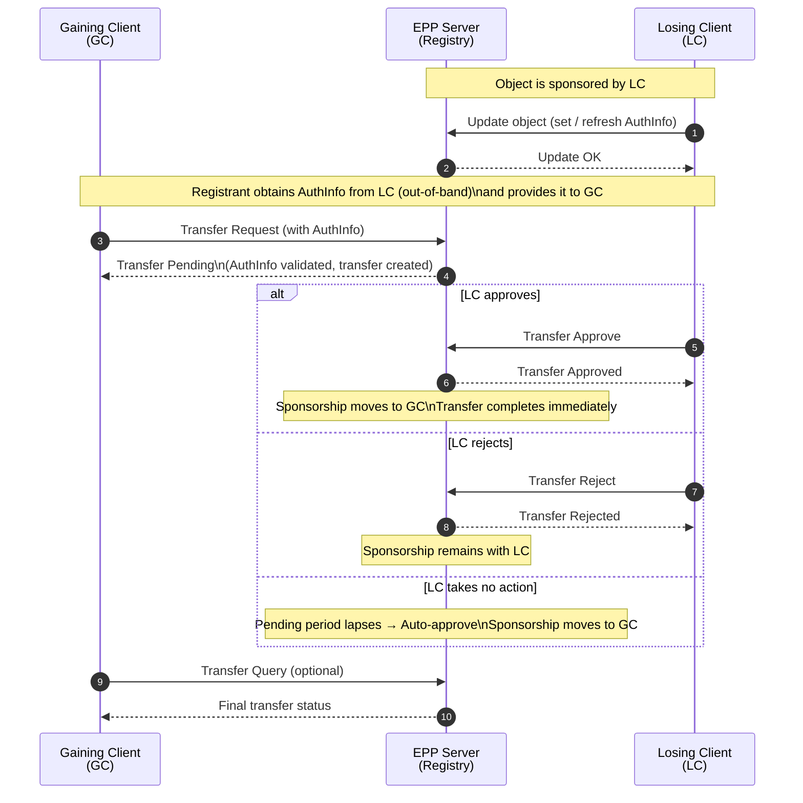

--- abstract

This document specifies a mechanism to enhance domain transfer
security by transitioning from a shared-secret authorization model
to a asymmetric cryptographic signature-based validation system.
Using asymmetric cryptographic signatures enables many benefits
over a shared secret, such as non-repudiation, improved
auditability through clear identification of the authorizing entity,
elimination of the need for registries to store and secure shared
secrets, replay protection through timestamp validation, and
reduced risk of interception since only the private key needs to
remain secret.

This document establishes the following AuthCodeSEC extension of EPP
with the following protocol elements:

1. Where to place the signature and hash data in the EPP command and
2. How is data hashed and signed, and how to verify the signature
3. How to verify the signature;

--- middle

# Introduction

The current domain transfer process relies on a shared secret
(authInfo) which is susceptible to interception, misuse, and lack of
auditability. This document proposes a simplified, secure replacement
using cryptographic signatures, building upon the Extensible
Provisioning Protocol (EPP) {{RFC5730}}.

Key features of this specification:

*   Mandatory use of ECDSA Curve P-256 with SHA-256 for strong
    security.

*   A flexible "Signer Payload" to clearly identify who authorized
    the transfer (e.g., Registrar, Regulator, Registry, or
    Registrant).

*   Removal of complex transition models in favor of a clean,
    signature-based approach.

## Motivation

The evolution of Internet protocols has consistently moved from
trust-based, shared-secret, or unauthenticated models toward
cryptographic verification to address modern security threats.

Two notable precedents within the IETF serve as guiding examples for
this specification:

*   HTTP to HTTPS (RFC 2818): The transition from plain HTTP to HTTP
    Over TLS addressed the inherent risks of eavesdropping,
    tampering, and man-in-the-middle attacks. By layering HTTP over
    TLS, the protocol ensured confidentiality and server
    authentication, eliminating the reliance on clear-text
    communication.

*   DNS to DNSSEC (RFC 4033, 4034, 4035): The original Domain Name
    System lacked data origin authentication and integrity. DNSSEC
    introduced cryptographic signatures to the DNS hierarchy,
    allowing resolvers to verify that data originated from the
    authoritative source and was not modified in transit, thus
    mitigating cache poisoning and spoofing attacks.

AuthCodeSEC applies these same principles to the domain transfer
process. The current shared-secret (AuthCode) model resembles the
early, unauthenticated era of other protocols. It is susceptible to
interception, unauthorized reuse, and lacks non-repudiation.

By adopting asymmetric cryptographic signatures, this specification
achieves:

1.  Strong Authentication: Replaces a static password with a digital
    signature, proving possession of a private key without revealing
    it.

2.  Elimination of Shared Secret Risks: Significantly reduces the
    attack surface by removing the shared secret entirely.

    *   Transit: The private key is never transmitted, making
        credential eavesdropping impossible.

    *   Storage: Registries no longer need to store and secure
        password databases, eliminating a major source of potential
        data leakage.

3.  Integrity: Ensures the transfer request data (domain, gaining
    registrar, timestamp) has not been tampered with.

4.  Non-repudiation: Provides cryptographic proof of the authorizing
    entity's intent, which is critical for audit trails and dispute
    resolution.

5.  Replay Protection: Mitigates the risk of intercepted
    authorization codes being reused maliciously or replayed.

This transition modernizes domain transfers to meet the security
standards established by other critical Internet infrastructure
protocols.

## Scope of this Specification

This specification defines the following elements of the AuthCodeSEC
protocol:

1.  EPP Extension Data Structure: The definition of the XML schema
    and element placement within the EPP domain:transfer command to
    transport the signature, signer identity, and metadata.

2.  Data Canonicalization and Digest Generation: The specific rules
    for formatting the transfer data (including domain name, gaining
    registrar ID, and timestamp) into a canonical string and hashing
    it with a specific hash algorithm.

3.  Asymmetric Cryptographic Authentication: The specific rules for
    signing the hash of the transfer data with a specific asymmetric
    cryptographic algorithm.

4.  Distribution of Public Keys: The specific rules for distributing
    the public key to the gaining registrar or other validating
    parties such as the registry or regulator.

## Current AuthCode Processes

The current {{RFC5731}} defines the following transfer process:

Domain Transfer Request (AuthCode) XML Example:

~~~ xml
<?xml version="1.0" encoding="UTF-8" standalone="no"?>
<epp xmlns="urn:ietf:params:xml:ns:epp-1.0">
  <command>
    <transfer op="request">
      <domain:transfer
       xmlns:domain="urn:ietf:params:xml:ns:domain-1.0">
        <domain:name>example.com</domain:name>
        <domain:period unit="y">1</domain:period>
        <domain:authInfo>
          <domain:pw roid="JD1234-REP">2fooBAR</domain:pw>
        </domain:authInfo>
      </domain:transfer>
    </transfer>
    <clTRID>ABC-12345</clTRID>
  </command>
</epp>
~~~

Key Fields:

*   op="request": Indicates we are initiating a transfer.

*   domain:period: (Optional) Extension to the registration period
    upon successful transfer (usually 1 year).

*   domain:authInfo: The authorization code provided by the
    registrant.

*   domain:pw: The actual text password (AuthCode).

## Requirements Language

The key words "MUST", "MUST NOT", "REQUIRED", "SHALL", "SHALL NOT",
"SHOULD", "SHOULD NOT", "RECOMMENDED", "NOT RECOMMENDED", "MAY", and
"OPTIONAL" in this document are to be interpreted as described in
BCP 14 {{RFC2119}} {{RFC8174}} when, and only when, they appear in all
capitals, as shown here.

# Protocol Description

## EPP Extension Data Structure

The EPP extension data structure is defined as follows:

~~~ xml
<?xml version="1.0" encoding="UTF-8" standalone="no"?>
<epp xmlns="urn:ietf:params:xml:ns:epp-1.0">
  <command>
    <transfer op="request">
      <domain:transfer
       xmlns:domain="urn:ietf:params:xml:ns:domain-1.0">
        <domain:name>example.com</domain:name>
        <domain:period unit="y">1</domain:period>
      </domain:transfer>
    </transfer>
  </command>
</epp>
~~~

We are replacing the `<domain:pw>` with `<domain:ext>` to support custom
authentication mechanisms (e.g., digital signatures or tokens).

TODO: Define detailed schema for the `<domain:ext>` element.

## Data Canonicalization and Digest Generation

The following data will be canonicalized and hashed to generate the
digest for the signature:

*   domain name
*   current expiration date
*   period
*   receiver info
*   endorsers info (optional)
*   further extensions (optional)

To ensure consistent signature generation and verification, the data
fields MUST be canonicalized by concatenating their UTF-8 string
representations in the order listed above, separated by a pipe
character ("|"). If a field is empty (like the receiver info), it
contributes an empty string between delimiters.

The canonicalized string is then hashed using the SHA-256 algorithm
to produce the digest that will be signed.

Receiver Info: The identifier of receiver, can be the gaining
registrar (e.g., IANA ID or other identifiers e.g. domain name of
the registrar). If the authorizing party wishes to restrict the
transfer to a specific receiver, this field MUST be populated. If
this field is left empty, the authorization is valid for ANY
receiver. This fits the use case like a gaining registrar is not yet
determined or disclosed to the losing registrar.

## Asymmetric Cryptographic Authentication

To ensure interoperability and security, this specification mandates
the use of specific algorithms while allowing for future
extensibility.

*   Signing Algorithm: Implementations MUST support ECDSA Curve P-256
    with SHA-256. This corresponds to:

    -   DNSSEC: IANA DNS Security Algorithm Number 13
        (ECDSAP256SHA256) {{RFC6605}} {{IANA-DNS-SEC-ALG}}.

    -   SSL/TLS: IANA TLS 1.3 TLS SignatureScheme 0x0403
        (ecdsa_secp256r1_sha256) {{RFC8446}} {{IANA-TLS-PARAMS}}.

    -   JWT: IANA JSON Web Signature and Encryption Algorithms
        "ES256" (ECDSA using P-256 and SHA-256) {{IANA-JOSE}}.

    -   FIDO: FIDO Registry of Predefined Values
        "ALG_SIGN_SECP256R1_ECDSA_SHA256_DER" (0x0002) {{FIDO-REGISTRY}}.

*   Extensibility: The protocol allows specifying other algorithms in
    the "alg" field for future extensibility. As described in
    {{RFC7518}}, additional algorithms may be supported.

## Public Key Distribution

The public key is distributed to all verifying parties, such as the
gaining registrar, the registry, and the regulator, via the following
mechanisms:

*   Registrar uses their DNS to publish the public key to the
    registry and other verifying parties.

# IANA Considerations

The following IANA considerations are required:

*   New hash algorithm registry.
*   New signing algorithm registry.

TODO: Define the IANA considerations for how to register the new
hash algorithms and signing algorithms.

# Security Considerations

TODO: Define the security considerations for the protocol.
